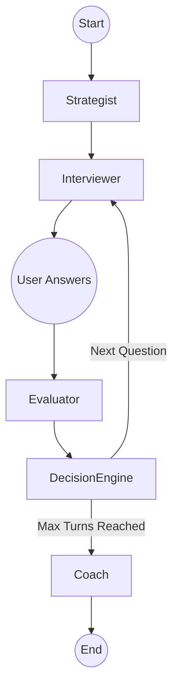

# InterviewPilot — Adaptive Multi-Agent AI Mock Interview Coach

InterviewPilot is an intelligent, multi-agent AI mock interview system that conducts dynamic, adaptive technical and behavioral interviews. It leverages a state-machine orchestrator to dynamically route conversations between multiple specialized LLM agents (Strategist, Interviewer, Evaluator, and Coach), evaluating responses in real-time to adjust question difficulty and topics.

## 🚀 Features

- **Multi-Agent Architecture**: Decoupled agents (Strategist, Interviewer, Evaluator, Coach) for specialized, high-quality generation and grading.
- **Adaptive Questioning**: A deterministic Decision Engine adjusts the difficulty and topic based on the candidate's real-time performance.
- **Robust Orchestration**: Powered by LangGraph, maintaining a strict and type-safe `InterviewState` across turns.
- **Provider Agnostic**: Easily swap between Groq, OpenAI, Anthropic, or local Ollama models via configuration.
- **Rich User Interface**: A Streamlit frontend for an interactive chat experience and structured post-interview coaching reports.
- **State Persistence**: Sessions are saved to disk as JSON files, allowing for easy resumption and export.

## 🏗️ Architecture

InterviewPilot uses a **StateGraph** (via LangGraph) to orchestrate the interview flow.



### The Agents
1. **Strategist**: Analyzes the candidate's profile and defines the initial plan (competencies, topics, baseline difficulty).
2. **Interviewer**: Generates context-aware, adaptive questions based on the candidate's history and the Decision Engine's instructions.
3. **Evaluator**: Grades answers on multiple dimensions (correctness, communication), identifying strengths and weaknesses.
4. **Decision Engine**: A deterministic state router (non-LLM) that analyzes the Evaluator's output to adjust the next turn's difficulty and topic.
5. **Coach**: Synthesizes the entire transcript into a comprehensive Markdown feedback report at the end of the session.

## 📝 Example Interview Transcripts

As required by the assignment specification, 3 complete multi-turn interview sessions are available in the `examples/` directory:

| Scenario | Target Role | Difficulty Trajectory | Summary & Agent Behavior | Artifact Link |
| :--- | :--- | :--- | :--- | :--- |
| **Strong Candidate** | Senior Data Engineer | 2 ➔ 3 ➔ 4 ➔ 5 ➔ 5 | Demonstrates high technical depth in PySpark & Kafka. Decision Engine escalates difficulty up to Level 5 and recommends `MOVE_ON`. | [strong_candidate_session.json](file:///c:/Users/Muskan%20Shaikh/Desktop/Upgrad/examples/strong_candidate_session.json) |
| **Weak Candidate** | Product Manager Intern | 2 ➔ 1 ➔ 1 ➔ 1 ➔ 1 | Candidate gives vague/superficial answers without frameworks. Evaluator flags gaps, Decision Engine triggers `PROBE_DEEPER` and `REDIRECT`. | [weak_candidate_session.json](file:///c:/Users/Muskan%20Shaikh/Desktop/Upgrad/examples/weak_candidate_session.json) |
| **Tricky / Edge Case** | Frontend Engineer | 2 ➔ 1 ➔ 1 ➔ 2 ➔ 2 | Candidate begins with "I don't know" and off-topic deflection, then recovers. System applies `SIMPLIFIED` and `NEW_TOPIC` routing. | [tricky_edgecase_session.json](file:///c:/Users/Muskan%20Shaikh/Desktop/Upgrad/examples/tricky_edgecase_session.json) |

## ⚙️ Setup & Installation

1. **Clone the repository and set up a virtual environment:**
   ```bash
   git clone <repo-url>
   cd interviewpilot
   python -m venv .venv
   
   # On macOS/Linux:
   source .venv/bin/activate
   # On Windows:
   .venv\Scripts\activate
   ```

2. **Install dependencies:**
   ```bash
   pip install -r requirements.txt
   ```

3. **Configure Environment Variables:**
   ```bash
   cp .env.example .env
   ```
   Open `.env` and fill in your preferred LLM provider details.
   ```env
   LLM_PROVIDER=groq  # Options: groq, openai, anthropic, ollama
   LLM_MODEL=llama-3.1-8b-instant
   GROQ_API_KEY=your_api_key_here
   ```

4. **Sanity Check:**
   Ensure your API connection is working before starting the application:
   ```bash
   python test_api_connection.py
   ```

## 🎮 Running the Application

Start the Streamlit application:
```bash
streamlit run app.py
```

The application has three main screens:
1. **Setup**: Enter your target role, background, and focus area.
2. **Interview**: Chat directly with the Interviewer agent. Your answers are evaluated in real-time.
3. **Report**: After reaching the turn limit, receive a detailed Markdown coaching report.

## 🧪 Testing

The project is fully unit-tested, including edge cases for API failures and state transitions.

```bash
# Run the test suite
pytest tests/

# Run with coverage (optional)
pytest tests/ --cov
```

## 📂 Design Decisions & Tradeoffs

- **Pydantic State Validation**: Used for all state representations (`InterviewState`) and structured LLM outputs (`generate_structured`). Ensures strict typing and prevents corrupted state progression downstream.
- **LangGraph State Machine**: Chosen over naive sequential chains to support a cyclic graph capable of conditional branching (e.g., dynamic probing vs. switching topics).
- **Deterministic Decision Engine**: Non-LLM routing logic guarantees reliable, predictable state transitions based on score thresholds rather than relying on LLM dynamic routing.
- **JSON File Persistence**: Session state is persisted as JSON files (`services/session_service.py`) for zero external database dependencies during evaluation, while enabling instant load/save/export capabilities.
