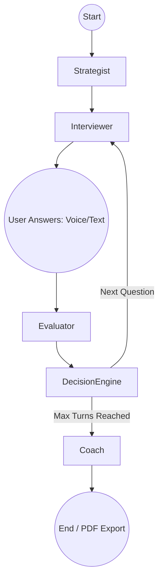

# InterviewPilot — Adaptive Multi-Agent AI Mock Interview Coach

**InterviewPilot** is an intelligent, multi-agent AI mock interview system that conducts dynamic, adaptive technical and behavioral interviews. It leverages a state-machine orchestrator to dynamically route conversations between multiple specialized LLM agents (Strategist, Interviewer, Evaluator, and Coach), evaluating responses in real time to adjust question difficulty and topics.

*A Project by Muskan*

---

## 🚀 Key Features & Capabilities

- 🤖 **Multi-Agent Architecture**: Decoupled agents (Strategist, Interviewer, Evaluator, Coach) powered by LangGraph state machines.
- 🎯 **Adaptive Difficulty & Routing**: A deterministic Decision Engine dynamically adjusts topic and difficulty (Levels 1–5) based on real-time candidate performance.
- 🎙️ **Voice-to-Voice Multimodal Mode**: Speak your answers into your microphone and hear the AI Interviewer speak back using Groq Whisper / SpeechRecognition STT and gTTS Text-to-Speech.
- 📷 **Live Webcam Practice Mode**: Integrated live camera feed to practice posture, body language, and eye contact during answers.
- 📄 **Resume Upload & Job Description Grounding**: Upload PDF/TXT resumes or paste target job descriptions to personalize interview questions to actual competencies.
- ⚡ **Multi-Language Code Execution Sandbox**: Candidate technical code submissions (Python, JavaScript, SQL) are safely executed in a subprocess sandbox with static linting (flake8).
- 🔍 **Autonomous Web Search Fact-Checking**: The Evaluator agent uses DuckDuckGo search to verify complex candidate technical claims in real time.
- 🧠 **FAISS Vector DB RAG Candidate Benchmarking**: Historical candidate performance profiles are embedded in a local FAISS vector store to compare candidate performance against peers.
- 📄 **Professional PDF & JSON Export**: Download a styled A4 PDF coaching report with performance metrics, multi-dimensional skill breakdown, and full turn-by-turn transcripts.
- 🎨 **Modern Glassmorphic UI**: Streamlit web interface with warm light styling, custom branding, and responsive column layouts.

---

## 🏗️ Architecture

InterviewPilot uses a **StateGraph** (via LangGraph) to orchestrate the interview flow:



### Specialized Multi-Agent Roles
1. **Strategist**: Analyzes the candidate's profile, resume, and job description to define the initial interview plan.
2. **Interviewer**: Generates context-aware, adaptive questions based on candidate history, code execution results, and Decision Engine directives.
3. **Evaluator**: Grades candidate responses across technical correctness, clarity, depth, and reasoning; fact-checks claims using web search tool.
4. **Decision Engine**: Non-LLM deterministic router that analyzes Evaluator scores to adjust difficulty (1-5) and select next-turn strategy.
5. **Coach**: Synthesizes full session performance into a comprehensive markdown & PDF feedback report benchmarked against past candidates via FAISS RAG.

---

## ⚙️ Setup & Installation

1. **Clone the repository and set up a virtual environment:**
   ```bash
   git clone <repo-url>
   cd upgrad
   python -m venv .venv
   
   # On Windows:
   .\.venv\Scripts\activate
   # On macOS/Linux:
   source .venv/bin/activate
   ```

2. **Install dependencies:**
   ```bash
   pip install -r requirements.txt
   ```

3. **Configure Environment Variables:**
   ```bash
   cp .env.example .env
   ```
   Open `.env` and fill in your preferred LLM provider details.
   ```env
   LLM_PROVIDER=groq
   LLM_MODEL=llama-3.1-8b-instant
   LLM_MODEL_STRUCTURED=llama-3.1-8b-instant
   GROQ_API_KEY=your_groq_api_key_here
   ```

4. **Sanity Check:**
   Verify your API key connection:
   ```bash
   python test_api_connection.py
   ```

---

## 🎮 Running the Application

Start the Streamlit application:
```bash
streamlit run app.py
```

The application features three main screens:
1. **Setup Screen**: Choose target role, focus area, upload resume, enable webcam/voice practice modes.
2. **Interactive Session**: Practice answering adaptive questions via text or voice with live camera feed on left.
3. **Coaching Report & Analytics**: View turn-by-turn trajectory charts, multi-dimensional skill breakdown, peer benchmark comparisons, and download Markdown, JSON, or PDF reports.

---

## 🧪 Testing

Run the full pytest suite (covering state machine transitions, audio service, vector DB, resume parser, and code executor):

```bash
python -m pytest tests/
```

---

## 🏗️ Key Design Decisions & Tradeoffs

1. **Deterministic vs. LLM Decision Engine**: We chose a deterministic, non-LLM Decision Engine to route the conversation and adjust difficulty. **Tradeoff**: While an LLM could handle subtle state transitions, a deterministic Python router ensures 100% stable state-machine boundaries, preventing "infinite loop" failures during rate limits and providing strict control over the interview length (max 5-7 turns).
2. **LangGraph State Orchestration**: The conversation flow uses LangGraph rather than a simple Python loop. **Tradeoff**: This adds boilerplate graph compilation logic, but enables clean "checkpointing" of state, allowing the UI to safely retry failed nodes (e.g., if the Evaluator hits a rate limit) without losing the entire interview context.
3. **Multi-Agent Decoupling**: Strategist, Interviewer, and Evaluator are distinct agents with isolated prompts. **Tradeoff**: Higher token usage since context must be re-injected for each agent. However, this ensures each agent maintains a strong persona (e.g., the Evaluator doesn't accidentally start generating questions) and allows specialized output parsing (e.g., JSON schema for Evaluator, Markdown string for Coach).
4. **Pydantic Validation**: We heavily utilize Pydantic `BaseModel` for all agent outputs. **Tradeoff**: Requires strict formatting from the LLM, but guarantees structured data for the frontend UI (e.g., rendering charts based on strict numerical 1-5 scores) and eliminates Regex hacks.

---

## 📜 Example Interview Transcripts

We have recorded example JSON session transcripts in the `examples/` directory to demonstrate the system's adaptability:

- 🌟 **[Strong Candidate](file:///examples/strong_candidate_session.json)**: A senior frontend engineer handling complex questions gracefully, triggering the Decision Engine to ramp up the difficulty to Level 4/5.
- 📉 **[Weak Candidate](file:///examples/weak_candidate_session.json)**: A junior analyst giving vague answers. The Interviewer adapts by simplifying the follow-up questions and lowering the difficulty.
- 🧩 **[Tricky / Edge Case](file:///examples/tricky_edgecase_session.json)**: A candidate attempting to derail the technical interview with off-topic remarks. The Evaluator handles the messiness gracefully, and the Interviewer nudges them back on topic.

---

## 🛡️ Deployment Readiness Checklist

- [x] **Secret Keys**: `.env` is listed in `.gitignore` and has never been committed.
- [x] **Environment Config**: `.env.example` contains clear templates for Groq, OpenAI, Anthropic, or Ollama.
- [x] **Dependencies**: All packages (Streamlit, LangGraph, FAISS, fpdf2, gTTS, etc.) are pinned in `requirements.txt`.
- [x] **Asset Paths**: Logo and assets use clean relative pathing (`assets/logo.png`).
- [x] **Clean Working Tree**: All features committed to Git.
